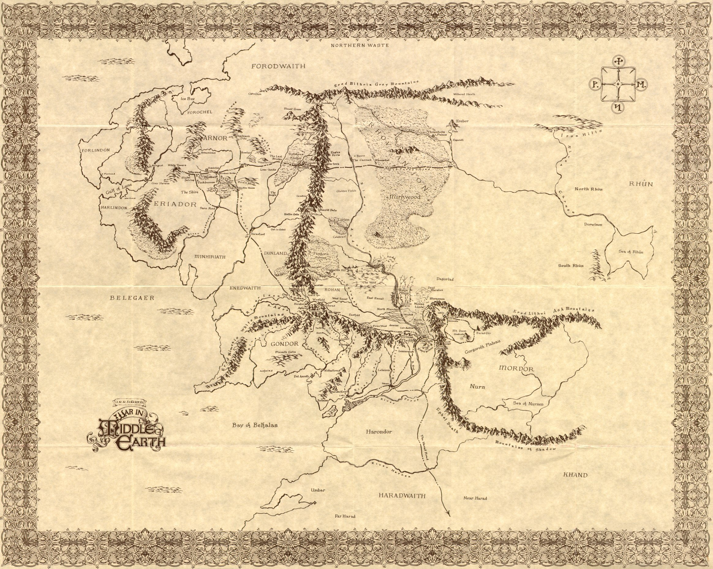
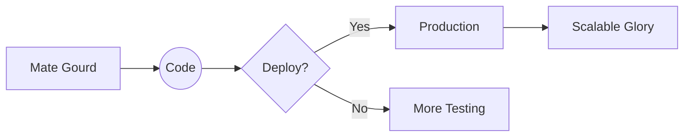

```markdown
# 🧙‍♀️ Rocío Baigorria aka Tuni  
*"Speak 'friend' and enter... to my code realm"*  
**Data Alchemist • Cloud Ranger • Mate-powered Coder**  

---

## 🌌 **The Red Book of Westmarch (README Edition)**  

### 🗡️ **Fellowship of the Stack**  
```rust
// Quest parameters
const CURRENT_CLASS: &str = "Cloud-Breaker Wizard";
const WEAPONS: [&str; 6] = ["Python", "AWS", "Terraform", "Kubernetes", "Streamlit", "React"];
const MOUNT: &str = "AWS Lambda";
const POTION: &str = "Argentinian Mate";
```

---

### 🏰 **Artifacts Forged in the Fires of Mount Doom**  

#### 🔮 **The Seeing Stone (ML Predictions)**  
*"One model to rule them all, one loss function to bind them"*  
- **Technologies**: Python • TensorFlow • Scikit-learn  

```python
def predict_future():
    while has_mate():
        train_model()
        deploy_to_production()
```

#### ⚔️ **Glamdring (Cloud Infrastructure)**  
*"Foe-hammer of legacy systems"*  
- **Technologies**: Terraform • AWS EC2 • S3  

```terraform
resource "aws_infrastructure" "mordor_gate" {
  scalability = "unlimited"
  resilience  = "Balrog-proof"
}
```

---

### 📜 **Scrolls of Wisdom (Education)**  
- **Minas Tirith Academy** (National University of La Plata)  
  *Majored in Data Prophecies*  
- **Isengard Institute of Technology** (UTN)  
  *Studied Pythonic Runes*  

---

### 🏹 **Quests Accomplished**  

| Artifact Name          | Magic Type          | Technologies                          |  
|------------------------|---------------------|---------------------------------------|  
| Ticket-Slaying Light    | Streamlit Sorcery   | Python • Pandas • NLP                 |  
| Lembas Playlist Creator | API Wizardry        | Terraform • Spotify API               |  
| Responsive Web-Cloak    | Elven Frontend      | HTML5 • CSS Grid • AWS S3             |  

---

### 🧪 **Current Brews in the Cauldron**  
- Teaching Ents about Kubernetes orchestration 🌳  
- Writing Elvish documentation (readable docstrings) 📜  
- Fortifying Helm's Deep (cluster security) 🏰  

---

### 📯 **Summoning Scroll**  
*"Look to my coming on the first pull request, at dawn look to the CI/CD pipeline."*  

[](https://www.linkedin.com/in/rociobaigorria/)  
📫 **Eagle Post**: `rociomnbaigorria@gmail.com`  

---

### 🔮 **Prophecy of Tomorrow**  


---

### 🧙‍♂️ **Gandalf's Wisdom**  
> *"All we have to decide is what to do with the CI/CD pipeline that is given to us."*  

---

**⚔️ May your merges be conflict-free and your deployments ever-green!**  
```diff
+ Added 5 new AWS certifications
! Fixed Balrog in production
- Deprecated legacy systems
```
---


